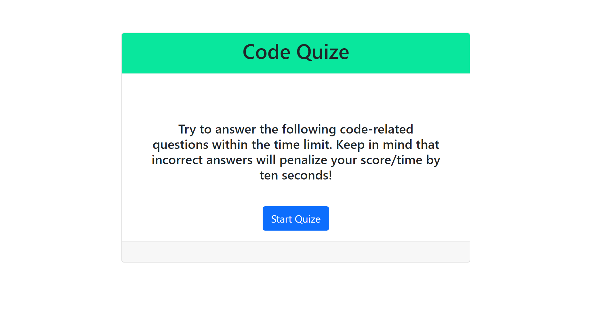
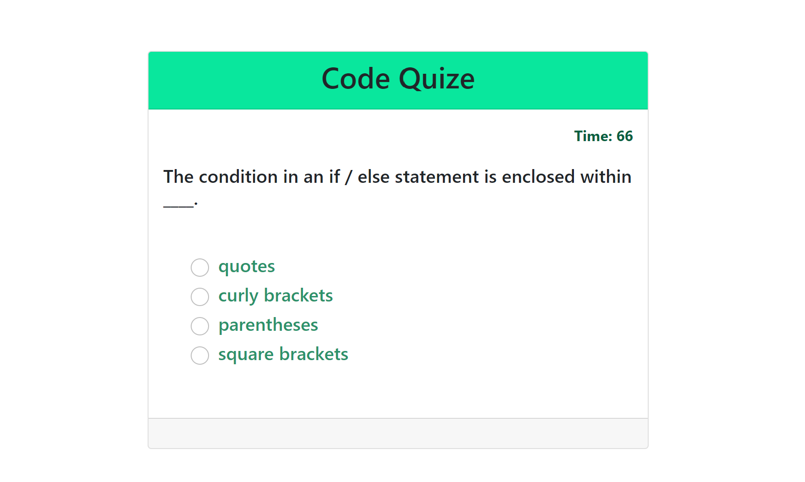

# Code-Quize

This is a quiz application using HTML, CSS, and Javascript. This application emphasizes the use of Javascript to provide quiz questions and collect user data to determine whether the answers to a question are correct, this then generates a score and appends a final page of results from the user data.

This project has been deployed to GitHub Pages. To get this project up and running, you can follow the deployment link. Or, download the sources files to use this as a template.
 https://shiva-shiva.github.io/Code-Quize/

 

 

Summary

    HTML and CSS and Javascript documents create a quiz with multiple choice questions with Javascript trivia
    This project emphasizes the use of using Javascript to make dynamic changes to an HMTL document
    This project utilizes the use of appending HTML pages.

Technologies Used

    JavaScript
    HTML
    CSS